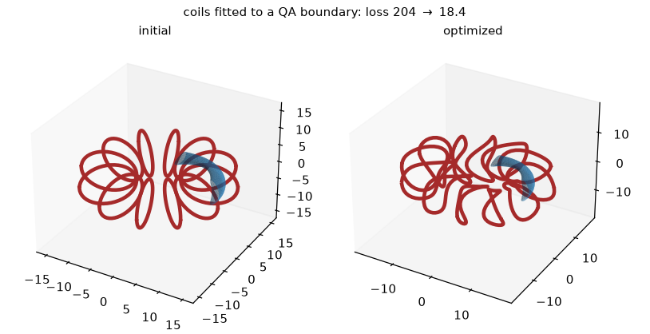
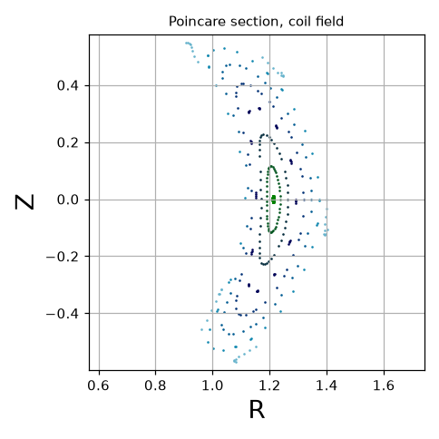
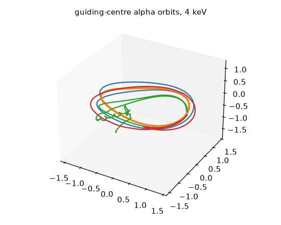

# ESSOS

<p>
    
    
    
    
</p>

Stellarator coil and particle optimization in JAX. Everything ESSOS computes —
coil geometry, Biot-Savart fields, guiding-centre orbits, field lines — is
differentiable end to end and runs on CPU or GPU, so a design objective and its
gradient come from the same code.

```sh
pip install essos
```

## What it does

- **Differentiable throughout.** `jax.grad` works through coil geometry, the
  field, and the traced orbits, so objectives compose without finite differences.
- **Coil optimization.** Fit coils to a plasma boundary under length, curvature,
  separation and coil-surface-distance constraints.
- **Particle tracing.** Guiding-centre and full-orbit (Boris) models, with
  collisions, electric fields and alpha-loss diagnostics.
- **Field-line tracing.** Adaptive, arclength and toroidal-angle models, with
  Poincare sections.
- **Fields.** Biot-Savart from coils, VMEC equilibria, near-axis expansions, and
  `CombinedField` to trace a sum of fields as one.
- **VMEC MGRID.** Export coil fields and load MGRID files as JAX-compatible
  three-dimensional magnetic fields.
- **Surfaces.** Fourier-represented toroidal surfaces, from a VMEC `wout` or
  built directly.
- **Parallel.** JAX sharding across the visible devices; pass `devices=` to pick.

## Coil optimization

Fit coils to a VMEC boundary, trading normal-field error against coil length and
curvature. Losses compose with `+`, and `L.grad` is the exact gradient.



```python
from essos.coils import Coils, CreateEquallySpacedCurves
from essos.fields import BiotSavart
from essos.losses import custom_loss
from essos.surfaces import BdotN_over_B, SurfaceRZFourier
from scipy.optimize import least_squares

surface = SurfaceRZFourier.from_wout_file("wout.nc", s=1, ntheta=30, nphi=30,
                                          range_torus="half period")
coils = Coils(curves=CreateEquallySpacedCurves(3, 3, 10.0, 5.6, n_segments=45,
                                               nfp=2, stellsym=True),
              currents=[1.0] * 3)

L = (custom_loss(lambda field, surface: abs(BdotN_over_B(surface, field)).sum(),
                 "field", surface=surface)
     + custom_loss(lambda field: (field.coils.length - 32.0).clip(0).mean(), "field")
     + custom_loss(lambda field: (field.coils.curvature - 0.1).clip(0).mean(), "field"))
L.dependencies = {"field": BiotSavart(coils)}

result = least_squares(L, L.starting_dofs, L.grad, max_nfev=400)
optimized = L.dofs_to_pytree(result.x)["field"].coils
```

More in [`examples/coil_optimization`](examples/coil_optimization).

## Field-line tracing



```python
import jax.numpy as jnp
from essos.coils import Coils
from essos.dynamics import Tracing
from essos.fields import BiotSavart

field = BiotSavart(Coils.from_json("coils.json"))
R0 = jnp.linspace(1.21, 1.40, 8)
seeds = jnp.array([R0, jnp.zeros_like(R0), jnp.zeros_like(R0)]).T

tracing = Tracing(field=field, model="FieldLineAdaptative", initial_conditions=seeds,
                  maxtime=8000, times_to_trace=40000, atol=1e-8, rtol=1e-8)
tracing.poincare_plot(shifts=[0.0])
```

More in [`examples/fieldline_tracing`](examples/fieldline_tracing).

## VMEC MGRID fields

Run [`examples/simple_examples/mgrid_from_coils.py`](examples/simple_examples/mgrid_from_coils.py)
to export the included Landreman-Paul QA coils, load the file as a magnetic
field, and compare its interpolated field with direct Biot-Savart. It prints
the differences and saves a plot; the maximum difference at its four sample
points is about 0.2%. Accuracy depends on grid resolution and distance from
the coils, so compare in your region of interest before using a grid.

The cylindrical grid covers one field period in phi. The field repeats across
periods, and R and Z queries are clamped to the grid bounds, so set the bounds
to cover the region you intend to evaluate.

## Particle tracing



```python
from essos.constants import ALPHA_PARTICLE_CHARGE, ALPHA_PARTICLE_MASS, ONE_EV
from essos.dynamics import Particles, Tracing

particles = Particles(initial_xyz=seeds, mass=ALPHA_PARTICLE_MASS,
                      charge=ALPHA_PARTICLE_CHARGE, energy=4000 * ONE_EV)
tracing = Tracing(field=field, model="GuidingCenterAdaptative", particles=particles,
                  maxtime=1e-4, times_to_trace=800, atol=1e-7, rtol=1e-7)
tracing.plot()
print(tracing.loss_fractions)
```

More in [`examples/particle_tracing`](examples/particle_tracing), including
full-orbit, collisional and electric-field variants.

## Tracing notes

- **VMEC magnetic axis.** VMEC guiding centres are integrated in
  `sqrt(s) (cos theta, sin theta)`, which is regular on the axis, so orbits
  cross it; trajectories are returned in `(s, theta, phi, ...)` with `theta`
  in `[0, 2 pi)`.
- **LCFS and wall.** A VMEC guiding-centre trace stops at the exact LCFS
  crossing (`tracing.lcfs_times`, `lcfs_positions`, `lcfs_energies`), found by
  root finding. Pass `exterior_field=` (ESSOS coils, a VMEX `VmecExtender` or
  `MgridField`, or any batched `xyz -> B`) and `wall=` (a `SurfaceClassifier`
  or a signed-distance callable, positive inside) to follow the orbit outside
  in Cartesian coordinates until it strikes the wall (`wall_times`,
  `wall_positions`, `wall_energies`) or comes back inside, where it returns to
  flux coordinates (`returns`). `tracing.status` gives each outcome
  (`essos.dynamics.VMEC_STATUS`); `trajectories_xyz` and `region` hold the
  whole orbit. A non-finite step ends that orbit as `failed`, with its time.
  Loss fractions use the exact wall, or LCFS, times. Collisions are switched
  off outside the LCFS. Supplying `condition` replaces these events; it is
  evaluated on `(s, theta, phi, ...)`. See
  [`examples/particle_tracing/trace_particles_vmec_to_wall.py`](examples/particle_tracing/trace_particles_vmec_to_wall.py).
- **Stopping coil-field traces.** Pass `stopping_criteria=LevelsetStoppingCriterion(...)`
  to end Cartesian traces once they leave a prescribed distance from a surface,
  and read the per-line mask from `tracing.boundary_hits`.
- **Step budget.** `max_steps` (default `1_000_000`) bounds every Diffrax solve,
  so a trace that cannot finish returns instead of running unbounded.
- **Progress bars** are off by default; pass `progress=True` when interactive.
- **Model choice.** `FieldLineArclength` traces a fixed physical length so
  rescaling `B` does not change the run; `FieldLineToroidal` sets coverage
  directly in toroidal angle for flux-coordinate fields.

## Optional: near-axis fields

Near-axis expansions need [pyQSC_JAX](https://github.com/uwplasma/pyQSC_JAX),
which is not on PyPI and therefore cannot be a declared dependency:

```sh
pip install git+https://github.com/uwplasma/pyQSC_JAX.git
```

Everything else works without it; the near-axis entry points raise with this
command if it is missing.

## Testing

```sh
pytest
```

## License

MIT, see [LICENSE](LICENSE).

## Acknowledgments

Developed by the [UWPlasma](https://rogerio.physics.wisc.edu/) group at the
University of Wisconsin-Madison, with support from Simons Foundation grant
560651.
