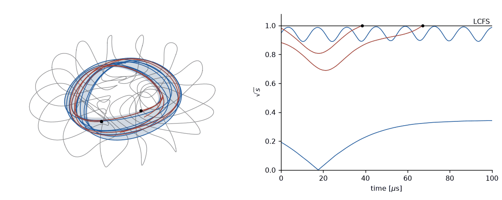
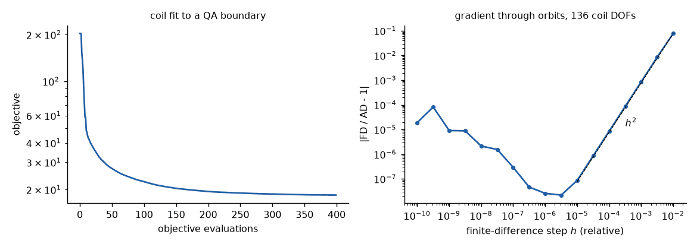

# ESSOS

[](https://pypi.org/project/essos/)
[](pyproject.toml)
[](LICENSE)
[](https://github.com/uwplasma/ESSOS/actions/workflows/build_test.yml)
[](https://codecov.io/gh/uwplasma/ESSOS)
[](https://essos.readthedocs.io/en/latest/)

ESSOS (e-Stellarator Simulation and Optimization Suite) computes stellarator
coil fields and charged-particle orbits in JAX. It evaluates Biot-Savart fields
of filamentary coils, VMEC equilibria and near-axis expansions, traces field
lines, guiding centers and full orbits, with Monte Carlo collisions against
background species, and optimizes coils against field, geometry and orbit
objectives. The fields, the orbit integrators and the objectives are written in
JAX, so a coil objective, a traced orbit and their derivatives with respect to
all coil degrees of freedom come from the same code, on CPU or GPU.

- **Coils and fields:** Fourier coils with stellarator symmetry, Biot-Savart with a fused
  guiding-center evaluation (B and its gradient from one Jacobian), VMEC `wout` files, near-axis
  fields, MGRID export and import, and `CombinedField` sums.
- **Orbits:** field lines (adaptive, arclength, toroidal-angle), guiding centers and full orbits
  (Boris and adaptive), Poincare sections, connection lengths to a wall, and loss fractions.
- **VMEC tracing:** guiding centers are integrated in `sqrt(s) (cos theta, sin theta)`, which is
  regular on the magnetic axis, so orbits pass through it; the Fourier modes are interpolated with
  their `sqrt(s)` behaviour there. An LCFS event ends each lost orbit, and loss fractions and loss
  times are counted at the LCFS.
- **Collisions:** Monte Carlo slowing down, pitch-angle scattering and energy diffusion against
  Maxwellian background species whose density and temperature can be radial profiles.
- **Optimization:** composable losses (`+`, scalar weights), SciPy, Optax and JAXopt drivers, an
  augmented Lagrangian for constrained problems, and multiobjective optimization; coil length,
  curvature, separation, surface distance, linking number, Lorentz force and orbit objectives.



3.5 MeV alpha particles in the bundled reactor-scale QA equilibrium, with the bundled QA coils
scaled to it. Blue orbits stay inside for 100 us, red ones reach the LCFS (black dots); of the 52
traced, 20 are lost. Right: one orbit passes through the axis (closest approach `sqrt(s)` =
8e-4), one is confined near the edge, two are lost.

## Installation

```console
pip install essos
```

Python 3.10, 3.11 and 3.12 are tested. The wheel installs JAX for the CPU; for a GPU, install the
matching JAX build after ESSOS (see the [JAX installation guide](https://docs.jax.dev/en/latest/installation.html)).
The examples and their input files live in the repository:

```console
git clone https://github.com/uwplasma/ESSOS
cd ESSOS
pip install -e . -r requirements.txt
pytest
```

Near-axis fields need [pyQSC_JAX](https://github.com/uwplasma/pyQSC_JAX), which is not on PyPI
and so cannot be a declared dependency: `pip install git+https://github.com/uwplasma/pyQSC_JAX.git`.
The near-axis entry points raise with this command if it is missing.

## First steps

From the root of a clone, trace alpha particles in a bundled VMEC equilibrium (about 15 s on a
laptop):

```python
import jax.numpy as jnp
from essos.dynamics import Particles, Tracing
from essos.fields import Vmec

vmec = Vmec("examples/input_files/wout_LandremanPaul2021_QA_reactorScale_lowres.nc")
n = 16  # 3.5 MeV alpha particles (the default) on s = 0.5, as (s, theta, phi)
seeds = jnp.array([jnp.full(n, 0.5), jnp.linspace(0, 2 * jnp.pi, n), jnp.zeros(n)]).T
particles = Particles(initial_xyz=seeds, initial_vparallel_over_v=jnp.linspace(-0.95, 0.95, n))
tracing = Tracing(field=vmec, model="GuidingCenterAdaptative", particles=particles,
                  maxtime=1e-3, times_to_trace=1000, atol=1e-8, rtol=1e-8)
print(f"alpha particles lost in 1 ms: {tracing.loss_fractions[-1]:.1%}")
```

and differentiate a field quantity with respect to every coil degree of freedom:

```python
import jax
import jax.numpy as jnp
from essos.coils import Coils
from essos.fields import BiotSavart

coils = Coils.from_json("examples/input_files/ESSOS_biot_savart_LandremanPaulQA.json")
point = jnp.array([1.2, 0.0, 0.0])
dB = jax.grad(lambda c: BiotSavart(c).AbsB(point))(coils)  # a Coils pytree
print(coils.dof_names[:3], dB.dofs[:3])
```

`tracing.trajectories`, `tracing.lost_times` and `tracing.plot()` hold the orbits; losses built
with `essos.losses.custom_loss` expose `L(x)`, `L.grad(x)` and `L.dofs_to_pytree(x)` for
optimizers.

Tracing controls: `devices=` shards particles over JAX devices; `max_steps` (default 10^6)
bounds every solve; `stopping_criteria=` ends coil-field traces at a surface (`boundary_hits`);
for a VMEC trace, passing `condition` replaces the LCFS event.

## Gradients and optimization



Left: coils fitted to a QA boundary by SciPy least squares with the exact gradient of normal
field, length and curvature penalties. Right: the gradient of the mean distance of eight guiding
centers from the axis after 10 us, taken through the adaptive orbit integration with respect to
all 136 coil degrees of freedom, agrees with central finite differences to 2e-8 at the best step.
Both panels: `python docs/make_readme_figures.py`.

## Comparison with SIMSOPT

The same Landreman-Paul QA coils in both codes, at the same tolerance
(`python examples/comparisons_simsopt/readme_benchmark.py`, and `ESSOS_DEVICES=8` for the
second ESSOS column; Apple M4 laptop, SIMSOPT 1.11 in one process):

| Task | ESSOS vs SIMSOPT | ESSOS, 1 / 8 CPU devices | SIMSOPT |
|---|---|---|---|
| Biot-Savart `B` at 10^4 points | 8e-16 relative | 0.027 s / 0.027 s | 0.015 s |
| 8 field lines, 60 m each, tol 1e-10 | 4e-9 m | 0.97 s / 0.90 s | 1.4 s |
| 8 guiding centers, 5 keV protons, 40 us, tol 1e-10 | 1e-8 m | 1.4 s / 1.0 s | 1.5 s |

The differences are those of the final positions. The ESSOS times are second calls; the
Biot-Savart function is compiled once, but each `Tracing` call still compiles its integrator,
about 0.5 s of each tracing time. On this shared laptop the times vary by up to 30% between
runs. The other scripts in [examples/comparisons_simsopt](examples/comparisons_simsopt/) compare
coils, surfaces, losses, full orbits and VMEC import, sweeping the tolerance.

## Examples

| Folder | What it shows |
|---|---|
| [simple_examples](examples/simple_examples/) | creating and perturbing coils, coils from near-axis or BOOZ_XFORM data, MGRID export, combined fields, derivatives |
| [fieldline_tracing](examples/fieldline_tracing/) | field lines and Poincare sections in coil and VMEC fields, connection length to a wall |
| [particle_tracing](examples/particle_tracing/) | guiding-center and full-orbit tracing in coil and VMEC fields, electric fields, loss classification |
| [particle_tracing_collisions](examples/particle_tracing_collisions/) | Monte Carlo collisions, velocity-distribution statistics |
| [coil_optimization](examples/coil_optimization/) | coils for a VMEC surface or near-axis field, particle confinement, forces and distances, augmented Lagrangian, stochastic and multiobjective optimization, finite-beta fields from VMEX |
| [comparisons_simsopt](examples/comparisons_simsopt/) | accuracy and speed against SIMSOPT (needs `pip install simsopt`) |
| [paper](examples/paper/) | integrator studies, guiding center against full orbit, gradients |

Run the scripts from the root of a clone; each sets its parameters near the top.

## Documentation and related codes

The documentation is at [essos.readthedocs.io](https://essos.readthedocs.io/en/latest/).
[VMEX](https://github.com/uwplasma/vmex) uses ESSOS coils for free-boundary and single-stage
optimization and provides the exterior field `VmecExtender`. Contributions are welcome through
issues and pull requests; `pytest` runs the test suite.

ESSOS is developed by the [UWPlasma](https://rogerio.physics.wisc.edu/) group at the University of
Wisconsin-Madison, with support from Simons Foundation grant 560651. MIT license, see [LICENSE](LICENSE).
