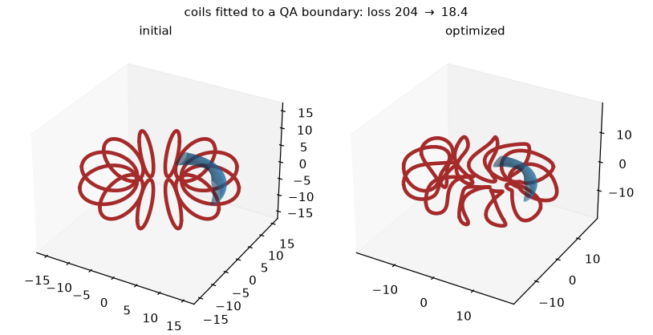
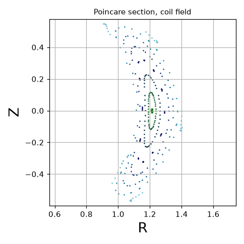
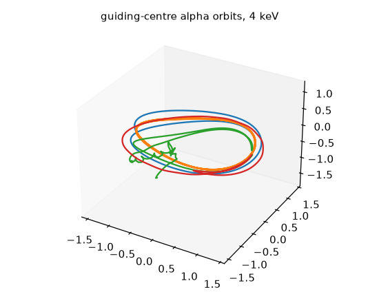
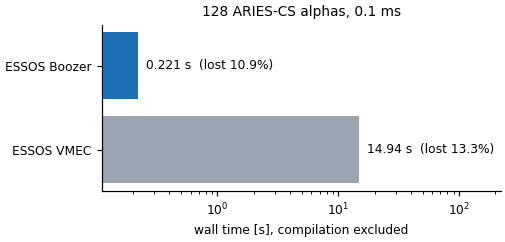

# ESSOS

<p>
    
    
    
    
</p>

Stellarator coil optimization and particle tracing in JAX, on CPU or GPU.
Coil objectives and adaptive tracing support automatic differentiation.

```sh
pip install essos
```

## What it does

- **Automatic differentiation.** `jax.grad` works through coil geometry,
  Biot-Savart fields and adaptive tracing.
- **Coil optimization.** Fit coils to a plasma boundary under length, curvature,
  separation, coil-surface-distance and force constraints, with `least_squares`,
  an augmented Lagrangian, multi-objective (Pareto) search, or stochastic
  optimization over Gaussian coil perturbations. Coils can also target a
  near-axis field, particle confinement, or a finite-beta (VMEX) boundary.
- **Particle tracing.** Guiding-centre and full-orbit (Boris) models, with
  Monte Carlo collisions on background species with density and temperature
  profiles, electric fields and alpha-loss diagnostics.
- **Boozer-coordinate tracing.** Guiding-centre diagnostics from the Boozer
  `|B|` spectrum and flux functions `iota`, `G` and `I`, with optional collisions.
- **Field-line tracing.** Adaptive, arclength and toroidal-angle models, with
  Poincare sections.
- **Fields.** Biot-Savart from coils, VMEC equilibria (analytic derivatives,
  optional `mode_tolerance` truncation), near-axis expansions, and
  `CombinedField` to trace a sum of fields as one.
- **VMEC MGRID.** Export coil fields and load MGRID files as JAX-compatible
  three-dimensional magnetic fields.
- **Surfaces.** Fourier-represented toroidal surfaces, from a VMEC `wout` or
  built directly.
- **Parallel.** JAX sharding across the visible devices; pass `devices=` to pick.
- **Checked against SIMSOPT.** [`examples/comparisons_simsopt`](examples/comparisons_simsopt)
  compares coils, surfaces, VMEC import, field lines, guiding-centre and
  full-orbit tracing, and losses with SIMSOPT on the same inputs.

## Coil optimization

Fit coils to a VMEC boundary, trading normal-field error against coil length and
curvature. Losses compose with `+`, and `L.grad` is the exact gradient.



```python
from essos.coils import Coils, CreateEquallySpacedCurves
from essos.fields import BiotSavart
from essos.losses import custom_loss
from essos.surfaces import BdotN_over_B, SurfaceRZFourier
from scipy.optimize import least_squares

surface = SurfaceRZFourier.from_wout_file("wout.nc", s=1, ntheta=30, nphi=30,
                                          range_torus="half period")
coils = Coils(curves=CreateEquallySpacedCurves(3, 3, 10.0, 5.6, n_segments=45,
                                               nfp=2, stellsym=True),
              currents=[1.0] * 3)

L = (custom_loss(lambda field, surface: abs(BdotN_over_B(surface, field)).sum(),
                 "field", surface=surface)
     + custom_loss(lambda field: (field.coils.length - 32.0).clip(0).mean(), "field")
     + custom_loss(lambda field: (field.coils.curvature - 0.1).clip(0).mean(), "field"))
L.dependencies = {"field": BiotSavart(coils)}

result = least_squares(L, L.starting_dofs, L.grad, max_nfev=400)
optimized = L.dofs_to_pytree(result.x)["field"].coils
```

More in [`examples/coil_optimization`](examples/coil_optimization).

## Field-line tracing



```python
import jax.numpy as jnp
from essos.coils import Coils
from essos.dynamics import Tracing
from essos.fields import BiotSavart

field = BiotSavart(Coils.from_json("coils.json"))
R0 = jnp.linspace(1.21, 1.40, 8)
seeds = jnp.array([R0, jnp.zeros_like(R0), jnp.zeros_like(R0)]).T

tracing = Tracing(field=field, model="FieldLineAdaptative", initial_conditions=seeds,
                  maxtime=8000, times_to_trace=40000, atol=1e-8, rtol=1e-8)
tracing.poincare_plot(shifts=[0.0])
```

More in [`examples/fieldline_tracing`](examples/fieldline_tracing).

## VMEC MGRID fields

Run [`examples/simple_examples/mgrid_from_coils.py`](examples/simple_examples/mgrid_from_coils.py)
to export the included Landreman-Paul QA coils, load the file as a magnetic
field, and compare its interpolated field with direct Biot-Savart. It prints
the differences and saves a plot; the maximum difference at its four sample
points is about 0.2%. Accuracy depends on grid resolution and distance from
the coils, so compare in your region of interest before using a grid.

The cylindrical grid covers one field period in phi. The field repeats across
periods, and R and Z queries are clamped to the grid bounds, so set the bounds
to cover the region you intend to evaluate.

## VMEC equilibria with VMEX

[VMEX](https://github.com/uwplasma/VMEX) solves a free-boundary equilibrium from
ESSOS coils; ESSOS reads its wout file and traces field lines through it.

```sh
pip install vmex
python examples/simple_examples/equilibrium_from_coils_vmex.py
```

[Example source](examples/simple_examples/equilibrium_from_coils_vmex.py).

## Particle tracing



```python
from essos.constants import ALPHA_PARTICLE_CHARGE, ALPHA_PARTICLE_MASS, ONE_EV
from essos.dynamics import Particles, Tracing

particles = Particles(initial_xyz=seeds, mass=ALPHA_PARTICLE_MASS,
                      charge=ALPHA_PARTICLE_CHARGE, energy=4000 * ONE_EV)
tracing = Tracing(field=field, model="GuidingCenterAdaptative", particles=particles,
                  maxtime=1e-4, times_to_trace=800, atol=1e-7, rtol=1e-7)
tracing.plot()
print(tracing.loss_fractions)
```

More in [`examples/particle_tracing`](examples/particle_tracing), including
full-orbit, collisional and electric-field variants.

## Boozer-coordinate tracing

Transform a VMEC equilibrium with [booz_xform_jax](https://github.com/uwplasma/booz_xform_jax),
then trace guiding centres in an axis-regular chart with fixed-step RK4 and
optional Monte Carlo collisions. This tracer provides forward diagnostics.

```python
import numpy as np
from netCDF4 import Dataset
from booz_xform_jax import Booz_xform
from essos.boozer import BoozerField, trace_boozer
from essos.constants import ALPHA_PARTICLE_CHARGE, ALPHA_PARTICLE_MASS, ONE_EV

booz = Booz_xform(verbose=0, mboz=32, nboz=32)
booz.read_wout("wout.nc", flux=False)
booz.run()
with Dataset("wout.nc") as wout:
    phi_edge = float(wout.variables["phi"][-1])  # boundary toroidal flux
field = BoozerField.from_booz_xform(booz, psi0=-phi_edge / (2 * np.pi),
                                    mode_tolerance=1e-3)

n = 1000
speed = np.sqrt(2 * 3.5e6 * ONE_EV / ALPHA_PARTICLE_MASS)
result = trace_boozer(field, s=np.full(n, 0.25), theta=np.random.uniform(0, 2*np.pi, n),
                      zeta=np.random.uniform(0, 2*np.pi, n), pitch=np.random.uniform(-1, 1, n),
                      speed=speed, mass=ALPHA_PARTICLE_MASS, charge=ALPHA_PARTICLE_CHARGE,
                      tmax=1e-2, timestep=1e-7)      # species=BackgroundSpecies(...) adds collisions
print(result.lost.mean(), result.loss_fractions())
```

`psi0` is minus VMEC's boundary toroidal flux over `2 pi`. A particle
is lost at `s = 1`; `result.loss_times` and `result.states` hold when and where.



| Case (8 CPU cores, compile excluded) | Tracer | Lost | Wall time |
|---|---|---|---|
| 128 ARIES-CS alphas, 0.1 ms | ESSOS Boozer (RK4) | 14.8% ± 3.1% | 0.91 s |
| | ESSOS VMEC coordinates (adaptive) | 13.3% ± 3.0% | 60.5 s |
| 1000 alphas, 10 ms (VMEX benchmark) | ESSOS Boozer | 12.8% | 146 s |
| | SIMPLE | 12.4% | 556 s |
| | SIMSOPT | 11.9% | 1079 s |

The first case is [`examples/particle_tracing/trace_particles_boozer_vs_vmec.py`](examples/particle_tracing/trace_particles_boozer_vs_vmec.py).
Its ± values are one-sigma binomial standard errors, `sqrt(p (1-p) / N)`.
Redraw the figure with `python docs/make_readme_boozer_figure.py`.

Boozer tracing evaluates `|B| = sum [bc_mn(s) cos(m theta - n zeta) + bs_mn(s) sin(m theta - n zeta)]`
and its derivatives, together with the flux functions `G`, `I` and `iota`.

## Tracing notes

- **VMEC magnetic axis.** VMEC guiding centres are integrated in
  `sqrt(s) (cos theta, sin theta)`, which is regular on the axis, so orbits
  cross it; trajectories are returned in `(s, theta, phi, ...)` with `theta`
  in `[0, 2 pi)`. A trace stops at `s >= 1` and reports it through
  `tracing.boundary_hits`. Supplying `condition` replaces that event; it is
  evaluated on `(s, theta, phi, ...)`.
- **Stopping coil-field traces.** Pass `stopping_criteria=LevelsetStoppingCriterion(...)`
  to end Cartesian traces once they leave a prescribed distance from a surface,
  and read the per-line mask from `tracing.boundary_hits`.
- **Step budget.** `max_steps` (default `1_000_000`) bounds every Diffrax solve,
  so a trace that cannot finish returns instead of running unbounded.
- **Progress bars** are off by default; pass `progress=True` when interactive.
- **Model choice.** `FieldLineArclength` traces a fixed physical length so
  rescaling `B` does not change the run; `FieldLineToroidal` sets coverage
  directly in toroidal angle for flux-coordinate fields.

## Optional: near-axis fields

Near-axis expansions need [pyQSC_JAX](https://github.com/uwplasma/pyQSC_JAX),
which is not on PyPI and therefore cannot be a declared dependency:

```sh
pip install git+https://github.com/uwplasma/pyQSC_JAX.git
```

Everything else works without it; the near-axis entry points raise with this
command if it is missing.

## Examples

| Folder | Contents |
|---|---|
| [`coil_optimization`](examples/coil_optimization) | VMEC and near-axis targets, augmented Lagrangian, stochastic, multi-objective, particle confinement, finite beta |
| [`fieldline_tracing`](examples/fieldline_tracing) | Coil and VMEC field lines, Poincare sections, connection length |
| [`particle_tracing`](examples/particle_tracing) | Guiding-centre and full-orbit tracing, classifiers, electric fields, Boozer vs VMEC |
| [`particle_tracing_collisions`](examples/particle_tracing_collisions) | Collisional tracing and velocity-distribution statistics |
| [`comparisons_simsopt`](examples/comparisons_simsopt) | Side-by-side runs with SIMSOPT |
| [`simple_examples`](examples/simple_examples) | Coils from near-axis or BOOZ_XFORM, perturbed coils, combined fields, MGRID |
| [`paper`](examples/paper) | Integrator, gradient and Poincare figures |

## Testing

```sh
pytest
```

## License

MIT, see [LICENSE](LICENSE).

## Acknowledgments

Developed by the [UWPlasma](https://rogerio.physics.wisc.edu/) group at the
University of Wisconsin-Madison, with support from Simons Foundation grant
560651.
