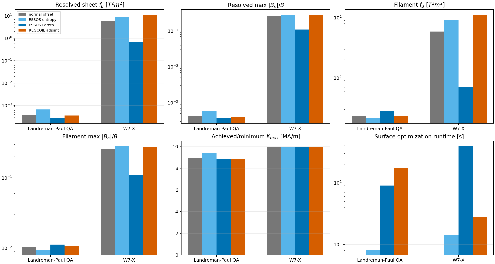
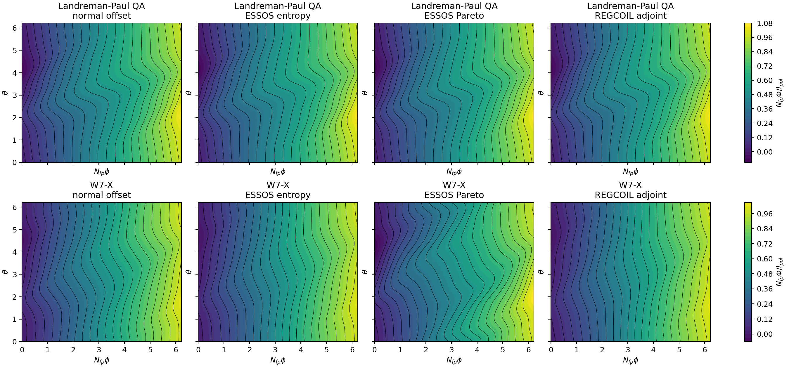
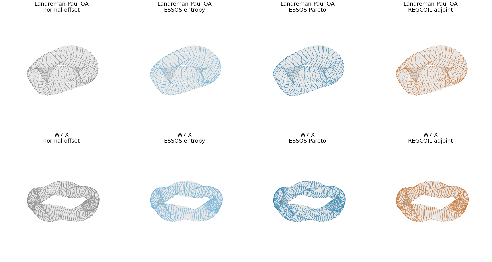
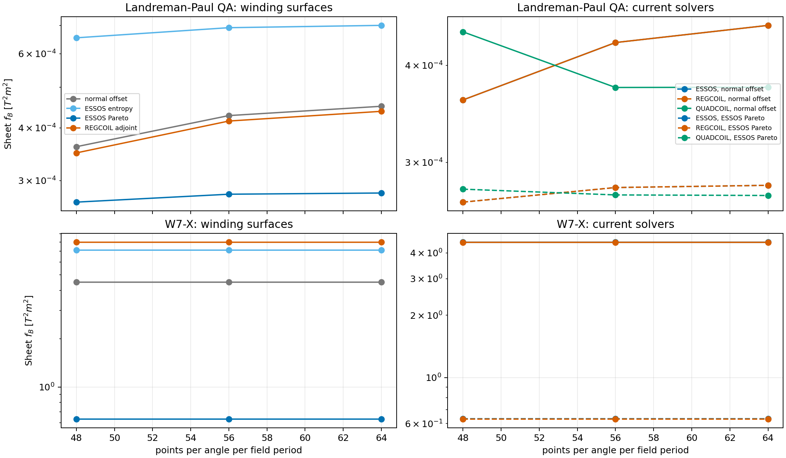
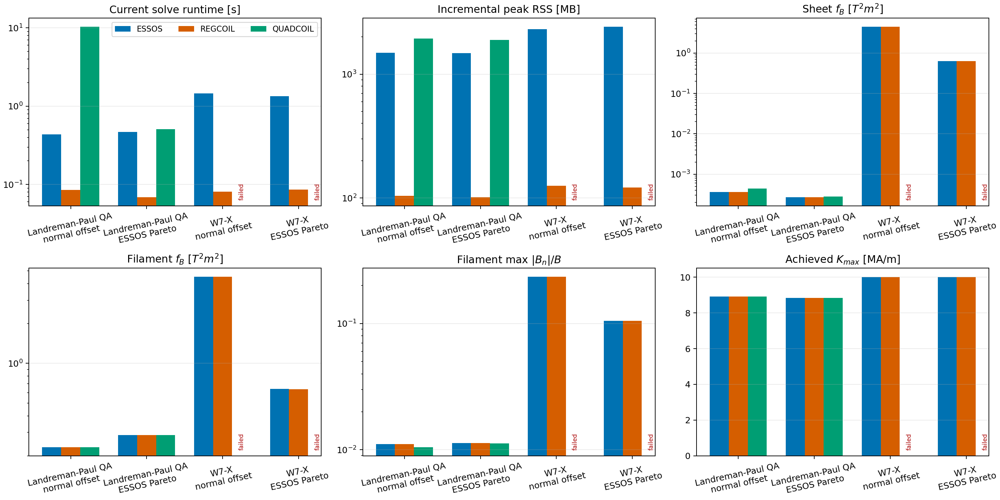
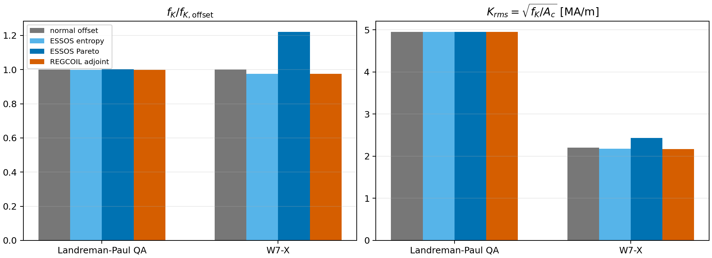
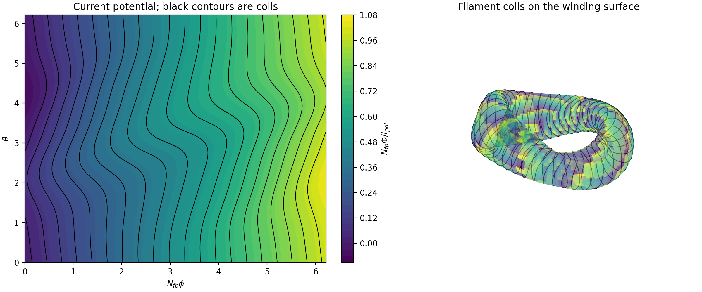

# Winding-surface comparison: local research notes

The study can be reproduced with `winding_surface_comparison.py`. Generated
intermediate files are written to `output/`; the final tables and figures from
the study are included here in `data/` and `figures/`.

Reference implementations used locally: modern REGCOIL commit `528c5d0`,
legacy REGCOIL branch `windingSurfaceOptimization_update`, and QUADCOIL commit
`368f4aa`. The relevant method papers are Paul et al. (2018),
https://arxiv.org/abs/1801.04317, and the QUADCOIL paper,
https://doi.org/10.1088/1741-4326/ada810.

## Protocol

- Configurations: Landreman–Paul QA and W7-X.
- Candidate surfaces: normal offset, ESSOS entropy, ESSOS three-point
  peak-current Pareto, and the legacy REGCOIL adjoint optimizer.
- Current-potential basis: `mpol=ntor=6` for every code.
- Peak-current limit: 10 MA/m.
- Outer ESSOS grids: 12×12 for entropy and 32×32 for the Pareto objective.
- Current-solver comparison: 48×48, followed by fixed-coefficient checks at
  56×56 and 64×64.
- Common surface validation: modern REGCOIL at 96×96, without changing any
  surface, using the same basis and current limit.
- Coil validation: 20 contours per field period from a 96×96 potential grid,
  with an independent filament Biot–Savart evaluation at 48×48.
- W7-X includes the same virtual-casing plasma-current field in every solve.

The legacy REGCOIL adjoint uses fixed RMS current (`lp_norm_K`, p=2) in the
outer optimization because that adjoint was verified against centered finite
differences. Its fixed-`max_K_lse` gradient did not pass that check. Every final
surface is nevertheless evaluated at the same 10 MA/m peak-current limit.

## Main result

The original 12×12 Pareto optimization was not valid. It hid narrow current
peaks: its W7-X surface had a minimum achievable peak current of 24.95 MA/m on
the 96×96 grid. Raising only the Pareto outer grid to 24×24 removes this failure;
32×32 improves both test cases further and is the selected setting.

| Configuration | Surface | 96×96 sheet fB [T²m²] | max |Bn|/B | Kmax [MA/m] |
|---|---:|---:|---:|---:|
| QA | normal offset | 3.746e-4 | 4.189e-4 | 8.923 |
| QA | ESSOS Pareto | 2.712e-4 | 3.692e-4 | 8.836 |
| QA | REGCOIL adjoint | 3.622e-4 | 4.040e-4 | 8.852 |
| W7-X | normal offset | 5.895 | 0.2596 | 10.000 |
| W7-X | ESSOS Pareto | 0.697 | 0.1095 | 10.000 |
| W7-X | REGCOIL adjoint | 11.193 | 0.2786 | 10.000 |

The corrected Pareto surface reduces resolved sheet fB by 27.6% relative to
the normal offset and 25.1% relative to legacy REGCOIL adjoint for QA. For W7-X,
the reductions are 88.2% and 93.8%, respectively.

For W7-X cut coils, filament fB falls from 5.909 for the normal offset to 0.703
for the Pareto surface (88.1%), and max |Bn|/B falls from 0.2602 to 0.1094.
For QA, however, filament fB increases from 0.2316 to 0.2865 even though its
sheet metric improves. This prevents a universal “better coils” claim.

The entropy proxy is not competitive in this test. At 96×96 it is worse than
the normal offset for both configurations. It should remain a diagnostic until
a physical link to the regularized current solve and cut-coil error is shown.

## ESSOS peak-current Pareto objective

For a trial winding surface, ESSOS first solves the standard regularized
current-potential problem at three nearby peak-current limits:

$$
\Phi_i=\underset{\Phi}{\operatorname{argmin}}\left[
f_B(\Phi)+\lambda_i f_K(\Phi)\right],\qquad
K_{\max}(\Phi_i)=K_i,
$$

with

$$
f_B=\int_{S_p}(\mathbf B\cdot\mathbf n)^2\,dA,
\qquad
f_K=\int_{S_c}|\mathbf K|^2\,dA
=\int_{S_c}|\nabla_s\Phi|^2\,dA,
$$

and $K_i=(0.95,1.00,1.05)K_{\mathrm{target}}$. The outer surface objective is

$$
J_{\mathrm{Pareto}}(S_c)=
\frac{1}{3}\sum_{i=1}^{3}
\frac{f_B(S_c;K_i)}{f_B(S_{c,0};K_i)}+J_{\mathrm{geometry}}.
$$

The three samples represent a short section of the $f_B$--$K_{\max}$ trade-off
curve. Optimizing all three prevents the surface from being tailored to one
regularization value. $J_{\mathrm{geometry}}$ preserves volume, controls the
Fourier spectrum, retains at least 90% of the initial plasma clearance, and
penalizes a small Jacobian or nonlocal self-approach. The peak-current penalty
is only active if the inner solve misses one of its requested limits.

This is called a three-point Pareto objective because it improves a local
section of the engineering trade-off curve. It is not a claim that the script
constructs the complete Pareto front.

The added complexity comparison uses the same $f_K$ as the inner REGCOIL-type
regularization. At 10 MA/m, ESSOS Pareto changes $f_K$ by +0.24% for QA and
+22.2% for W7-X relative to the normal offset. The corresponding RMS current
changes from 4.956 to 4.953 MA/m for QA and from 2.208 to 2.432 MA/m for W7-X.
The large W7-X reduction in $f_B$ therefore comes with about 10% higher RMS
surface current, even though both surfaces satisfy the same 10 MA/m peak limit.

## Figures

Resolved surface and filament metrics:

Current potential and coil contours from the resolved solutions:

Resolved coils and winding surfaces:

Grid convergence and current-solver comparison:

Current-potential complexity at the resolved 96×96 solutions:

Standalone 7 MA/m example:

The 48×48 diagnostic figures are also retained for traceability:

- [Surface metrics](figures/surface_metrics.png)
- [Current potential](figures/surface_current_potential.png)
- [Coils](figures/surface_coils.png)
- [Surfaces and coils](figures/surface_and_coils.png)

## Minimal tracked example

The smallest robust change to `winding_surface_opt_2.py` is to use 32 poloidal
points and 32 toroidal points per field period, cap each active Fourier step at
2% of the plasma minor radius, and treat 90% of the starting clearance as a
hard practical floor. No new objective is added.

At the example's original 7 MA/m target, an independent 96×96 REGCOIL solve
gives sheet fB = 2.712 instead of 19.873 for the normal-offset surface (86.4%
lower), while max |Bn|/B falls from 0.0569 to 0.0267. Re-solving the current at
96×96 and cutting 40 filaments gives fB = 3.010 instead of 20.331 (85.2% lower).
The standalone cutter applied directly to the saved 32×32 solution gives fB =
3.188 and max |Bn|/B = 0.0288. Those saved coefficients have a dense 96×96
Kmax of 6.989 MA/m, so the current constraint is not being missed.

## QUADCOIL interpretation

QUADCOIL's current-potential mode order and units match the shared evaluator.
Its very small same-grid native residual at low resolution was a cancellation
and quadrature artifact, not a coefficient-convention error. At 48×48 the QA
solutions from ESSOS, REGCOIL, and QUADCOIL agree closely after refinement.
The public QUADCOIL workflow exposes KKT derivatives with respect to winding
surface coefficients, so an outer optimizer can be built, but it is not a
turnkey robust winding-surface optimizer. Its W7-X current solves did not
converge here and are marked failed rather than plotted as valid results.

## What is defensible now

The result supports a focused claim: a small, direct, three-point Pareto
objective can produce a better current-sheet winding surface than a normal
offset and the tested legacy REGCOIL adjoint workflow, in much less outer
optimization time, provided the outer current grid is sufficiently resolved.
It does not yet support a universal claim of superiority to REGCOIL or
QUADCOIL, nor a claim that every improved sheet surface yields better coils.

## Next experiments before publication

1. Repeat at 32, 40, and 48 outer Pareto resolution and validate every result
   at 96 and 128 points. Report total wall time, including compilation.
2. Add at least four more equilibria and several normal-offset distances. Do
   not tune weights independently for each configuration.
3. Add a coil-realization term or robust contour-cut ensemble only if it fixes
   the QA sheet-to-filament reversal. Keep sheet optimization and coil
   realization metrics separate.
4. Compare against a carefully converged legacy REGCOIL adjoint run with
   multiple surface resolutions and outer initializations. The present legacy
   run uses only 12 outer iterations and a fixed-RMS-current adjoint.
5. Implement and finite-difference-check a QUADCOIL outer winding-surface run
   on the same cases before making a direct optimization claim against it.
6. Add tests only after the final discretization and objective are fixed.
