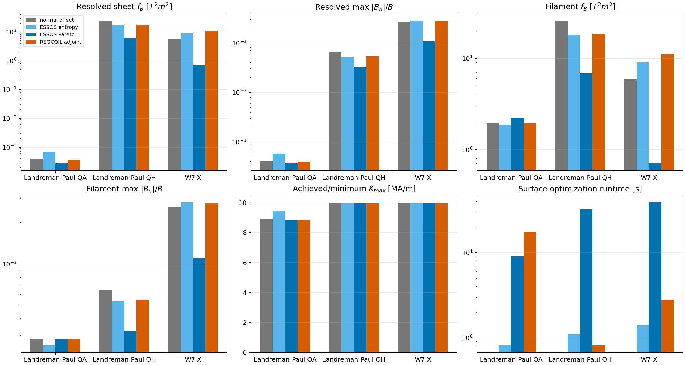
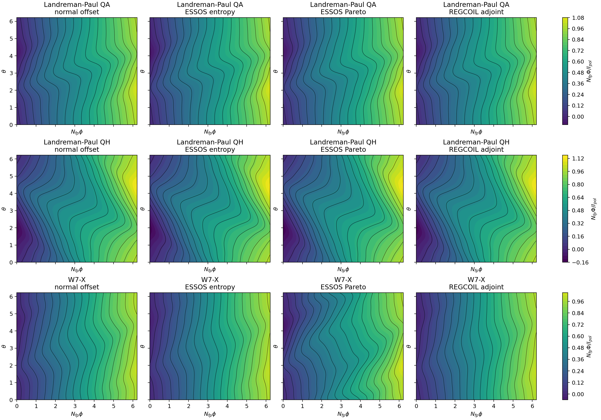
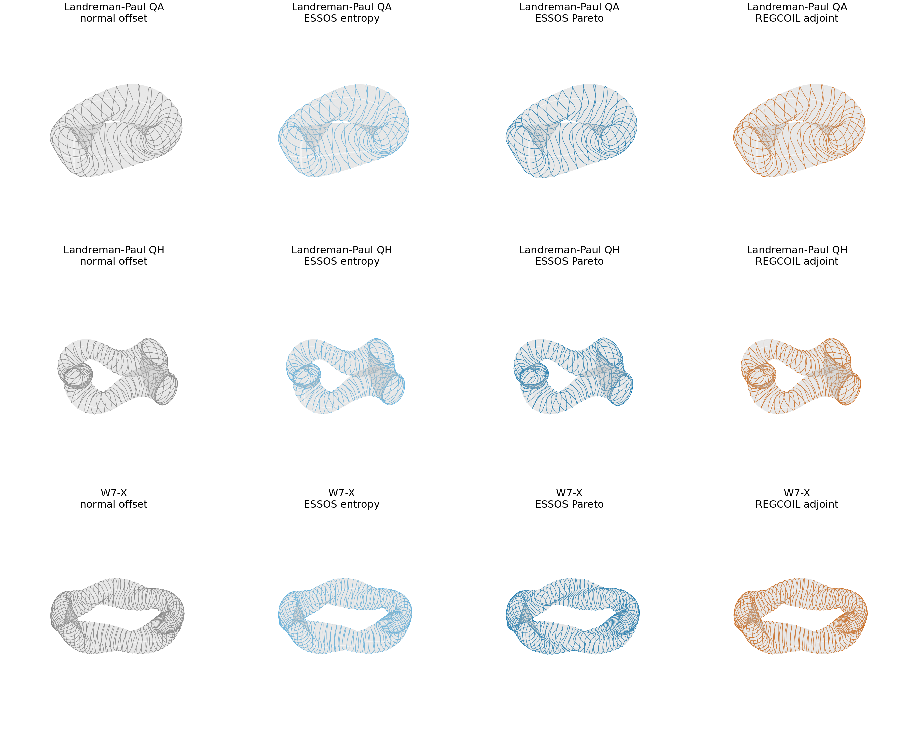
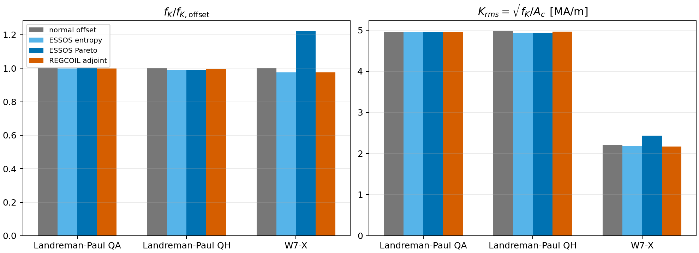
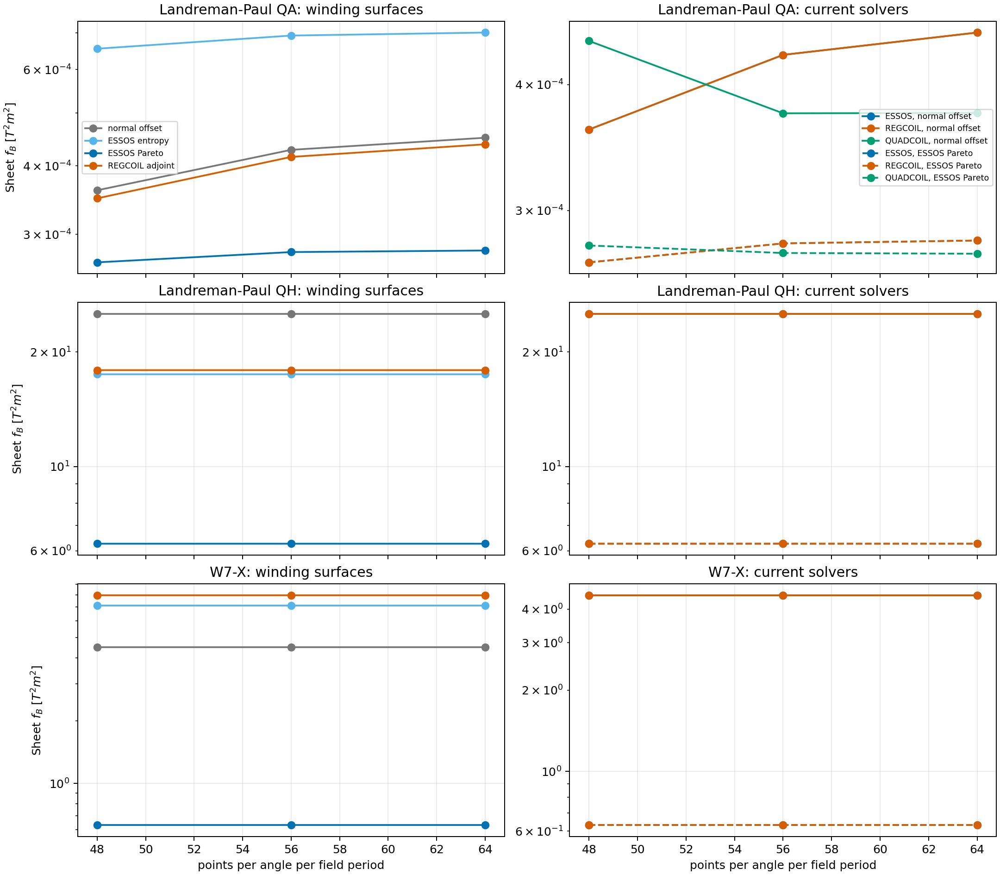
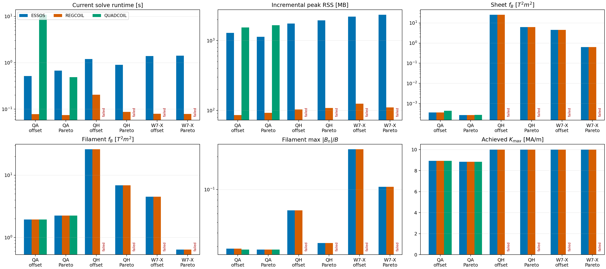

# Winding-surface comparison with fewer coils

This is an additive version of the comparison in
`examples/winding_surface_comparison`. It uses eight coils per half field
period instead of ten and adds the Landreman–Paul QH equilibrium. The earlier
study and its results are unchanged.

Run `winding_surface_comparison.py` with no arguments. Intermediate files are
written to `output/`; the final tables and figures are included in `data/` and
`figures/`. Set `RESUME_COMPARISON=1` to reuse completed runs and
`REGCOIL_ADJOINT` to the legacy REGCOIL winding-surface executable.

## Protocol

- Configurations: Landreman–Paul QA, Landreman–Paul QH, and W7-X.
- Candidate surfaces: normal offset, ESSOS entropy, ESSOS three-point
  peak-current Pareto, and the legacy REGCOIL adjoint optimizer.
- Current-potential basis: `mpol=ntor=6`; peak-current limit: 10 MA/m.
- ESSOS surface grids: 12×12 for entropy and 32×32 for Pareto.
- Common validation: REGCOIL at 96×96 with fixed surfaces, followed by an
  independent filament Biot–Savart evaluation at 48×48.
- Coil cut: 16 contours per field period, or eight coils per half field
  period. This gives 32 total coils for QA, 64 for QH, and 80 for W7-X.
- W7-X includes the same virtual-casing plasma-current field in every solve.

The QA and W7-X surfaces are identical to the earlier study because contour
count affects only the coil cut. Their current sheets were re-solved and their
coils were re-cut. All four QH winding surfaces were optimized in this study.

## Main findings

| Configuration | Surface | sheet fB [T²m²] | sheet max \|Bn\|/B | filament fB [T²m²] | filament max \|Bn\|/B |
|---|---:|---:|---:|---:|---:|
| QA | normal offset | 3.746e-4 | 4.189e-4 | 1.940 | 0.02822 |
| QA | ESSOS Pareto | 2.712e-4 | 3.692e-4 | 2.245 | 0.02825 |
| QA | REGCOIL adjoint | 3.622e-4 | 4.040e-4 | 1.942 | 0.02829 |
| QH | normal offset | 25.199 | 0.06434 | 26.075 | 0.06447 |
| QH | ESSOS Pareto | 6.263 | 0.03209 | 6.886 | 0.03245 |
| QH | REGCOIL adjoint | 17.925 | 0.05458 | 18.683 | 0.05490 |
| W7-X | normal offset | 5.895 | 0.2596 | 5.908 | 0.2587 |
| W7-X | ESSOS Pareto | 0.697 | 0.1095 | 0.704 | 0.1103 |
| W7-X | REGCOIL adjoint | 11.193 | 0.2786 | 11.209 | 0.2772 |

For QH, the ESSOS Pareto iterate reduces the independently resolved sheet fB
by 75.1% relative to the normal offset and 65.1% relative to the tested
REGCOIL adjoint surface. Its filament fB reductions are 73.6% and 63.1%.
For W7-X, the corresponding filament reductions are 88.1% and 93.7%.

QA exposes the limitation of a sheet-only winding-surface objective. The
Pareto surface improves sheet fB by 27.6%, but with only eight coils per half
period its filament fB is 15.7% worse than the normal offset. Reducing the
contour count from ten to eight raises QA filament fB by roughly a factor of
eight for every surface. W7-X changes by less than 1%, since its field error is
already dominated by the current-sheet solution rather than contour density.

The QH Pareto run stopped after seven iterations when the line search failed.
The saved iterate is geometrically valid and feasible at 10 MA/m on the 96×96
validation grid, but it is reported as a non-converged iterate rather than a
final optimum. QUADCOIL did not complete the matched QH solve after more than
six minutes and about 2.8 GB of memory; its QH entries are marked failed.
The previously observed W7-X QUADCOIL failures are also retained as failures.

## Figures

Resolved sheet, filament, current-limit, and runtime metrics:

Current potential and eight coil contours per half field period:

Resolved winding surfaces and coils:

Current-potential complexity:

Resolution and current-solver comparisons:

The 48×48 diagnostic figures are retained for traceability:

- [Surface metrics](figures/surface_metrics.png)
- [Current potential](figures/surface_current_potential.png)
- [Coils](figures/surface_coils.png)
- [Surfaces and coils](figures/surface_and_coils.png)

## Interpretation

The third equilibrium strengthens the result that the three-point Pareto
surface objective can substantially improve a current sheet at fixed peak
current without materially reducing or uniformly inflating the whole
operator. It also strengthens the opposite warning: a better current sheet is
not automatically a better small coil set. A publication claim should therefore
separate winding-surface quality from contour realization and add a deliberate
coil-realization term before claiming uniformly better coils.
