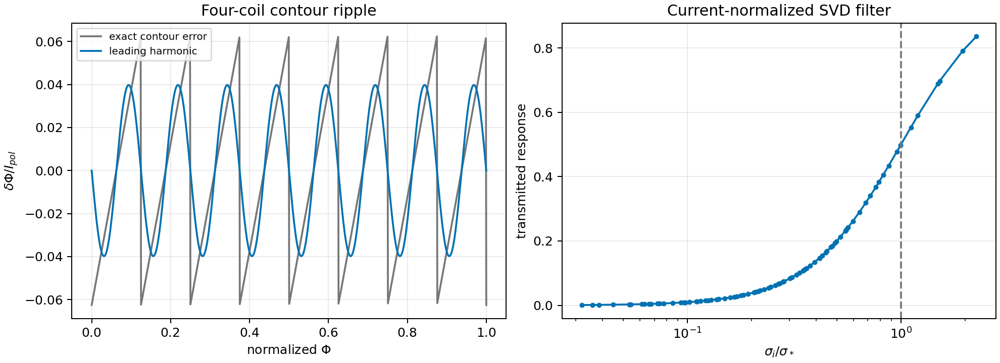
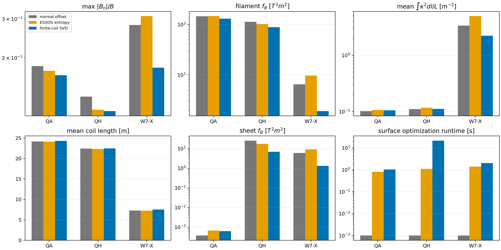
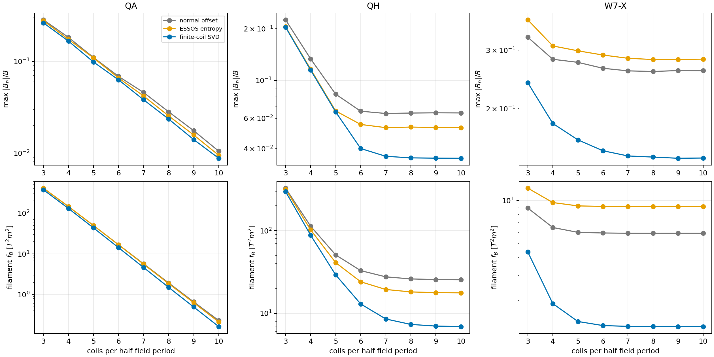
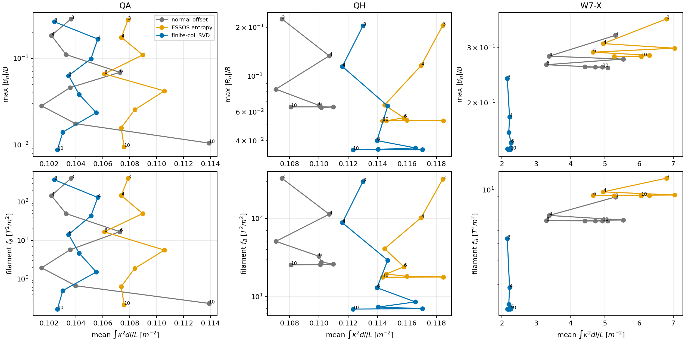
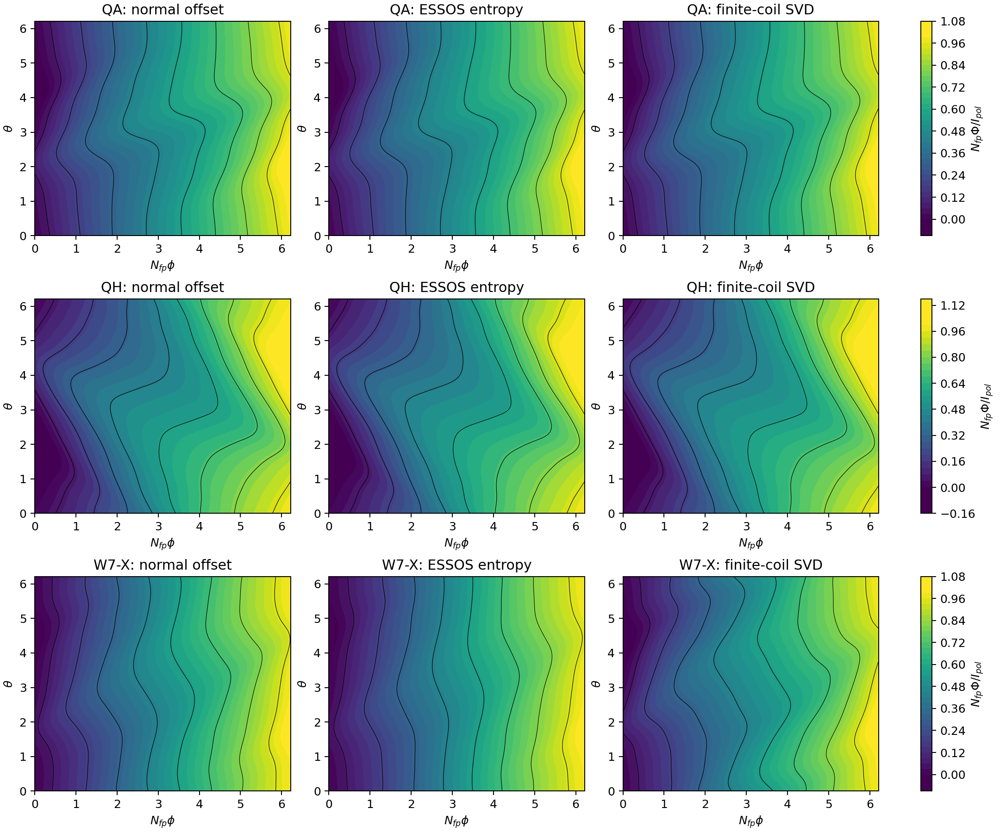
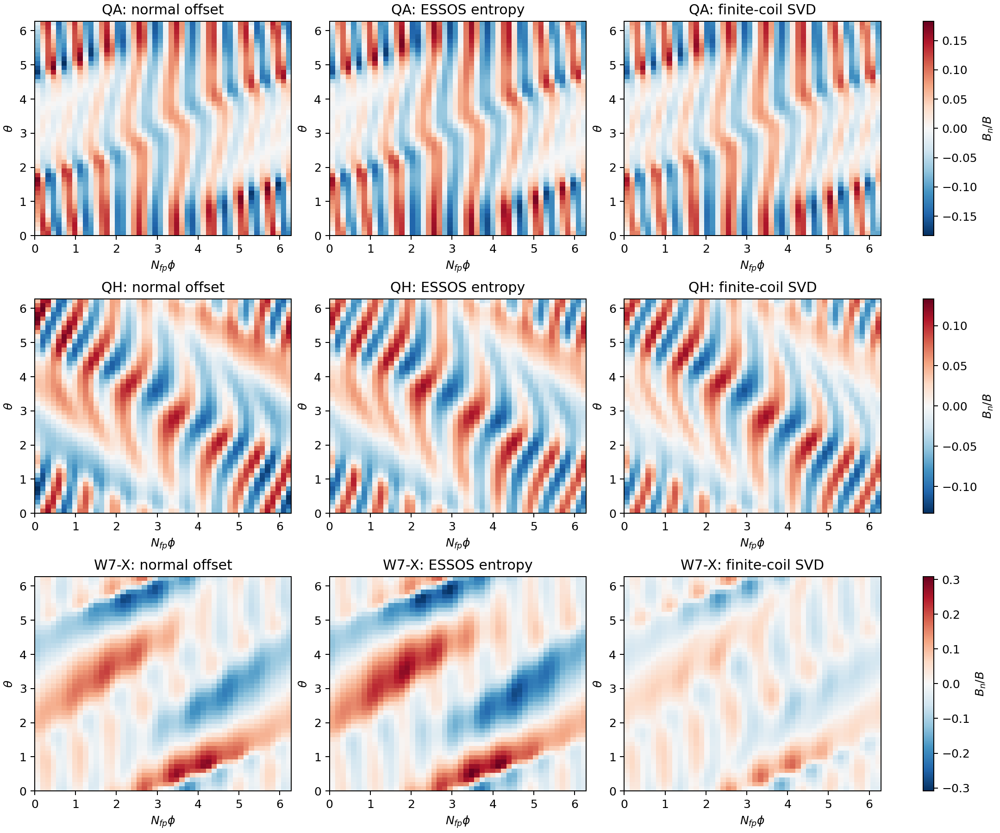
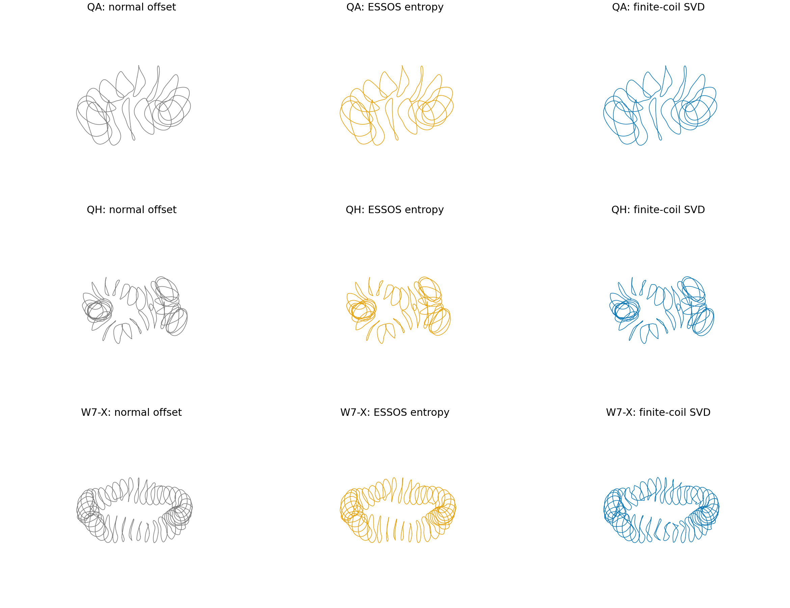
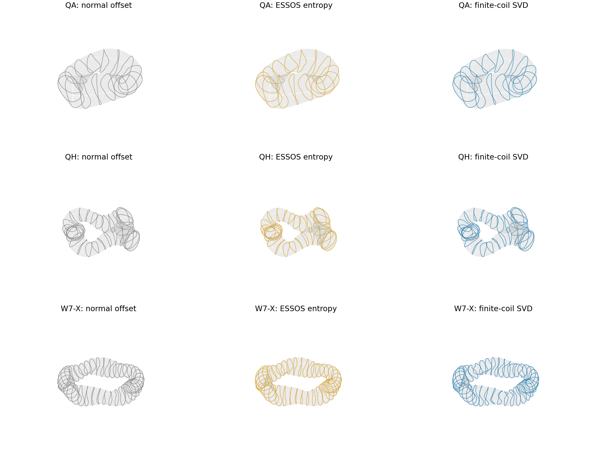
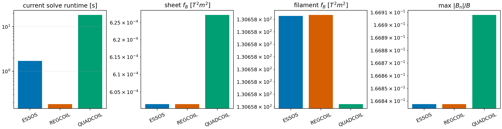

# Winding surfaces for a small number of coils

[`winding_surface_opt_3.py`](../winding_surface_opt_3.py) keeps the SVD idea but gives it a direct link to the
coils that will be cut. The current-potential solve is written in
current-normalized coordinates,

$$
\widehat A=A C^{-1/2}=U\Sigma V^T,
\qquad
y=-V\,\mathrm{diag}\left(\frac{\sigma_i}{\sigma_i^2+\sigma_*^2}\right)U^T b,
$$

where $C$ is the surface-current quadratic form. The code evaluates this
filter with a positive-definite solve, so it does not differentiate an SVD.

For $N$ coils per half field period there are $M=2N$ contour levels per field
period and

$$
\Delta\Phi=\frac{I_{pol}}{N_{fp}M}.
$$

The leading Fourier components of the error made by replacing the continuous
current sheet with equally spaced contours are

$$
\delta\Phi_c=\frac{\Delta\Phi}{\pi}
\sin\left(\frac{2\pi\Phi}{\Delta\Phi}\right),\qquad
\delta\Phi_s=-\frac{\Delta\Phi}{\pi}
\cos\left(\frac{2\pi\Phi}{\Delta\Phi}\right).
$$

The surface objective is therefore one field-error measure,

$$
J_N=\|A\Phi+b\|_W^2+
\frac{1}{2}\left(\|A\delta\Phi_c\|_W^2+
\|A\delta\Phi_s\|_W^2\right).
$$

The second term is phase averaged, so the surface is not fitted to an arbitrary
choice of the first contour. The existing distance, Jacobian and tangent-point
terms remain as geometry safeguards.

## Comparison

The outer optimization used a 24 by 24 grid per field period. Every surface was
then re-solved with REGCOIL at 96 by 96, using `mpol=ntor=6` and the same
10 MA/m limit. Coils were cut from a 96 by 96 potential and evaluated with a
separate filament Biot-Savart calculation at 48 by 48. W7-X includes its
virtual-casing plasma-current field.

Four coils per half field period:

| Configuration | Surface | filament $f_B$ [$T^2m^2$] | max $|B_n|/B$ | mean $\int\kappa^2dl/L$ [$m^{-2}$] | surface time [s] |
|---|---|---:|---:|---:|---:|
| QA | normal offset | 145.33 | 0.1834 | 0.1022 | 0 |
| QA | ESSOS entropy | 146.38 | 0.1746 | 0.1074 | 0.82 |
| QA | finite-coil SVD | **130.66** | **0.1669** | 0.1056 | 1.05 |
| QH | normal offset | 113.39 | 0.1334 | 0.1107 | 0 |
| QH | ESSOS entropy | 102.42 | 0.1162 | 0.1170 | 1.10 |
| QH | finite-coil SVD | **88.27** | **0.1147** | 0.1116 | 21.52 |
| W7-X | normal offset | 6.48 | 0.2816 | 3.382 | 0 |
| W7-X | ESSOS entropy | 9.68 | 0.3090 | 4.957 | 1.40 |
| W7-X | finite-coil SVD | **1.91** | **0.1803** | **2.228** | 2.05 |

Relative to the normal offset, the new surface reduces four-coil filament
$f_B$ by 10.1%, 22.1% and 70.5%, and max $|B_n|/B$ by 9.0%, 14.0% and 36.0%
for QA, QH and W7-X. QH took 21.5 s because L-BFGS-B used many line-search
evaluations; one objective-and-gradient call remains about 0.1 s.

ESSOS, REGCOIL and QUADCOIL were also run on the same QA surface. Their cut-coil
results agree to better than 0.05%. This separates the winding-surface result
from the choice of current-potential solver.

## Figures

## Limits

This is a leading-harmonic model of equal-current contours. It does not include
coil-coil clearance, ports, finite build, forces or a full filament optimization.
The absolute four-coil errors are still 0.11--0.18, so this is a better stage-1
surface, not a finished coil set. ESSOS filament optimization can refine these
coils, but it introduces weights, initialization dependence and usually several
runs. The clean workflow is to use this fast objective in stage 1, scan the one
free contour phase, and only then apply filament refinement where it is needed.
